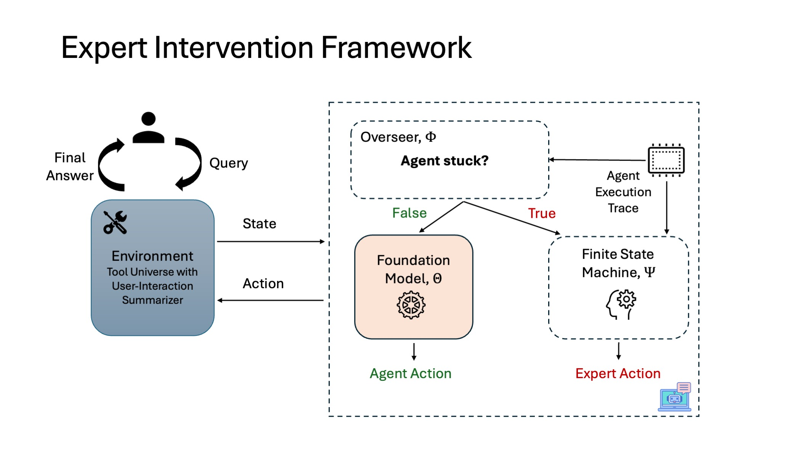

# Agentic Training/Inference Benchmarking for Tool-Calling LLMs on M3

This project benchmarks large language models (LLMs) on their ability to use tools effectively in a **multi-hop, multi-turn, multi-source/tool question answering agentic setting**. The agent operates in a gym-style MDP environment, solving tasks by invoking tools at each step and producing a final answer through a `FINAL` action. 

## Releases
<details>
<summary>Existing</summary>
We currently support SFT and DPO training. Specifically, for DPO we have step-level v/s trajectory-level preference data generation and training support. Additionally, by looking at step-level reward categories, we further have an option to mask suboptimal traces while creating trajectory-level preferences during training.
</details>
<details>
<summary>Future</summary>
</details>

## 📚 Table of Contents
- [Environment Setup](#-python-environment-setup)
- [Agentic Inference Environment](#-agentic-inference-environment)
- [Environment Scenarios](#-environment-scenarios)
- [Supported Language Models](#-supported-language-models)
- [Data Generation](#-data-generation)
- [Training](#-training-lora-based-fine-tuning-of-agentic-language-models)
- [Evaluation](#-evaluation)

---

## 🧱 Python Environment Setup

To get started, create a Python environment and install the necessary dependencies.

### 🔧 Step 1: Create Conda Environment

```bash
conda create -n AgenticAI python=3.11
conda activate AgenticAI
```

### 📦 Step 2: Install Dependencies

```bash
pip install -r requirements.txt
```

This will install all required packages for running the agentic pipeline, including support for LoRA training, multi-turn inference, DeepSpeed, and more.

---

## 🧭 Agentic Inference Environment

The agent acts as a decision-making policy in an MDP, invoking **one tool per step**, and emitting a `FINAL` action with the answer when complete.

📚 Amongst the tools available which are mostly API endpoints in M3, there is a Special Tool: `retrieve_documents` (name defined at [constants.py](envs/constants.py))

A core tool that allows the agent to query a knowledge base. Required arguments:

* `collection`: Name of the document collection (e.g., `"clapnq-company_docs"`)
* `query`: The query string to retrieve relevant documents
* **[Future Work]** `top_k`: We can consider top_k as a predicted argument to have the agent even reason over document collection. What combination of query and top_k fetches the ground-truth document in order to optimise the query. Currently, `"top_k"` is kept constant and provided in the config file.

Example tool call:

```json
{
  "tool_name": "retrieve_documents",
  "args": {
    "collection": "clapnq-company_docs",
    "query": "What is the employee leave policy for 2025?"
  }
}
```

---

### 🔍 Inference Setup: Pre-requisites
- **[Setup retriever]** To use database index, you need to acquire the username, password, host_name, certificate. Save the certificate in `es_cert` at the root directory. Set username, password as `ES_USERNAME` and `ES_PASSWORD` in the `.env` 
- **[Setup API Endpoint]** To use and query APIs, gain access to api endpoint 
- **[Setup LLMs]** Set the following parameters to use the Language Models and save them in the `.env` at the root directory 
  - `RITS_API_KEY`: API key to use language models via RITS
  - `HF_TOKEN`: Huggingface token

---

### 🛠️ Environment Configuration
The parameters for governing the structure and behavior of the agent and its task environment are defined in:
📄 `configs/infer_agent.json`

| Key                           | Description                                                                                                                                             |
|-------------------------------|---------------------------------------------------------------------------------------------------------------------------------------------------------|
| `path_to_env_data`            | Path to `.json` file containing environment task data                                                                                                   |
| `env_subdomain_mode`          | One of: `rest`, `slot_filling`, `selection` — controls API tool granularity                                                                             |
| `env_scenario`                | One of: `rag_before_api`, `api_before_rag` — controls G.T. tool call ordering                                                                           |
| `db_config`                   | Configuration for document collection/index usage (`retrieve_documents`)                                                                                |
| `api_config`                  | Configuration for the REST API tool endpoints                                                                                                           |
| `horizon`                     | Max number of steps the agent can take before the episode ends                                                                                          |
| `overseer_model_name_or_path` | RITS Model to serve as an overseer (corresponding prompt in [overseer.py](prompts/judge/overseer.py))                                                   |
| `scorer_model_name_or_path`   | RITS Model to serve as an final answer evaluator (corresponding prompt in [answer_matcher_binary.py](prompts/judge/answer_matcher_binary.py))           |
| `expert_model_name_or_path`   | RITS Model to serve for expert intervention (corresponding prompt in [observation_witness.py](prompts/judge/observation_witness.py))                    |
| `resume_instance`             | Resume run specific parameter. ID of environment instance to resume from. See index at the last Environment Instantiated message in log file to find it |
| `path_to_prev_run_dir`        | Resume run specific parameter. Directory where previous run's trajectories are saved at                                                                 |

---

### 🧠 Expert Intervention/Assistance Modes
Here's how the expert intervention mechanism works:


The framework supports various expert-assisted settings for supervising or augmenting agent decisions. 
Controls if and how the expert (which has access to ground-truth trajectories) is used. Set via `expert_mode`:

| Mode           | Description                                                                  |
|----------------|------------------------------------------------------------------------------|
| `None`         | Agent operates independently throughout                                      |
| `ground_truth` | Expert solves the entire task (for generating LLM-agnostic supervision data) |
| `random`       | Coin flip based on `expert_assist_random_epsilon` decides if expert steps in |
| `informed`     | Expert intervenes based on whether the agent is stuck or repeatedly failing  |

Additional expert parameters for the case when `expert_mode` is set to `informed`:

| Key                            | Description                                                                                                                                             |
|--------------------------------|---------------------------------------------------------------------------------------------------------------------------------------------------------|
| `save_alternate_trace`         | (bool) Whether to save alternate actions either by agent or expert at various branching points in trajectory. To collect preference data, set to `true` |
| `expert_assist_random_epsilon` | Probability of expert intervention in `random` mode                                                                                                     |
| `expert_assist_init_limit`     | (Positive int) Steps agent is allowed to act unaided initially                                                                                          |
| `expert_assist_recent_limit`   | (Negative int) Number of past steps to monitor for repeated failure                                                                                     |


Note: Collecting preference data by enabling expert intervention only collects the chosen and rejected samples at step-level.

**Future Work**: Expand `get_alternate_action_trace()` function in `run.py` to collect complete alternate trajectories starting at given state by recursively expanding akin to traversing possible paths in a binary tree

---

## 🧩 Environment Scenarios

The agent operates within configurable **environment scenarios** that define both **tool availability** and **tool usage constraints**. These scenarios determine how the agent interacts with tools while attempting to solve a task. 

**Where to specify?** They must be provided for each sample/environment instance within the `path_to_env_data`. See `env.reset()` for further information on how it is loaded.

### 🔌 Tool Availability (`tool_availability`)

Specifies which tools are available to the agent during inference:

| Setting                    | Description                                                      |
|----------------------------|------------------------------------------------------------------|
| `only_rag`                 | Only the **Retriever** (`retrieve_documents`) tool is available  |
| `only_api`                 | Only **API** tools are available                                 |
| `both_api_rag` *(default)* | Both Retriever and API tools are available                       |
| `neither_api_rag`          | No tools are available; agent must reason without external tools |


### 🚫 Tool Usage Policy (`tool_usage`)

A **textual constraint** that defines policies on tool invocation for specific **subdomains** or **document collections**. For example, it can restrict the agent from using the retriever on certain collections or the API in specific subdomains.

* **Default:** `""` (no restrictions)
* **Example:** `"Do not use the tool $retrieve_documents$ for the domain dealing with company documents."`


### ⚠️ Tool Ablation Behavior

If the agent **requires** a tool that is made **unavailable** (either through `tool_availability` or `tool_usage`), it is expected to:

> **Acknowledge its inability** to gather the necessary information and **terminate** with a `FINAL` action indicating that it **cannot answer** the query due to tool limitations.

This ensures clarity in evaluation and enables benchmarking tool-dependency across models.

---

## 🤖 Supported Language Models

The following models are supported as agents:

| Model Name                              | Chat Template      | Cutoff Len | Notes              |
|-----------------------------------------|--------------------|------------|--------------------|
| `mistralai/mixtral-8x22B-instruct-v0.1` | `teacher_rits`     | 65536      | Supported via RITS |
| `mistralai/Mistral-7B-Instruct-v0.3`    | `student_mistral`  | 32768      | Supported via HF   |
| `Qwen/Qwen3-8B`                         | `student_qwen3`    | 40960      | Supported via HF   |
| `ibm-granite/granite-3.3-8b-instruct`   | `student_granite3` | 131072     | Supported via HF   |

Set the parameters for the agentic model to use via the key:

```json
{
  "agent_model_name_or_path": "mistralai/Mistral-7B-Instruct-v0.3",
  "agent_template": "teacher_rits",
  "is_hf_agent": false,
  "temperature": 0.0,
  "max_new_tokens": 4096
}
```

Description of other parameters configuring model and its behaviour:

* `is_hf_agent`: Boolean whether the LLM to be used for the agent is provided by Huggingface or RITS
* `agent_template`: One of `student_mistral`, `student_qwen3`, `student_granite3`, `teacher_rits`
* `max_new_tokens`: Number of tokens to generate
* `temperature`: Sampling temperature
* `path_to_hf_config`: Path to json file specifying other parameters for running the HF model

---

## 📦 Data Generation
Training data is generated in two stages, both designed to provide supervision signals for learning i.e. supervised fine-tuning (SFT) and preference modeling (DPO). Each step of each trajectory is annotated with a reward category, for GRPO like training methods.

Here’s a clear and well-structured **“📦 Data Generation”** section for your README:

### 🛠️ Preliminary Setup

Before generating any data, begin by parsing the raw environment data into a **pipeline-consumable format**.

📄 Refer to the README in the [`ground_truth`](./ground_truth) directory for details on how to generate this preprocessed format.


### 🧭 Stage 1: Generating Expert Trajectories (SFT Data)

Set the following configuration in `configs/infer_agent.json`:

```json
{"expert_mode": "ground_truth"}
```

This will run the expert policy to **solve each task fully**, producing **gold-standard trajectories** used for supervised fine-tuning (SFT).

📁 Output: Trajectories in a standardized format, one per task instance


### 🔍 Stage 2: Generating Preference Data (Exploratory Agent with Expert Intervention)

Set the following configuration in `configs/infer_agent.json`:

```json
{"expert_mode": "informed"}
```

In this mode, the **agent interacts with the environment**, and the **expert intervenes** when necessary (e.g., if the agent is stuck or making repeated errors). This generates **step-level preference data**, based on whether the agent or the expert took the action.

⚙️ You must ensure the underlying LLM agent is set up correctly:

* ✅ Either via **RITS** or a **local Hugging Face endpoint**
* 🔗 See the [previous section](#-supported-language-models) on how to configure model-specific parameters like `model_name_or_path` and `chat_template`

**[Future Work]:** Work in progress to generate preference data at trajectory level by comparing trajectories of two separate agents (one better than other) here at [create_pref_trajectories_for_dpo.py](create_pref_trajectories_for_dpo.py). For this we need trajectories from two separate agents.

### 🚀 Running the Pipeline

* If using the **CCC cluster**, set `ENV_NAME`, `ROOT_DIR` and `HF_CACHE_DIR` in the shell script, and then you can launch the data generation using the provided shell script:

  ```bash
  bsub < ./ccc_scripts/infer_agent.lsf.sh
  ```

  Example Usage:
  ```shell
  # Assign arguments to variables
  ENV_NAME="AgenticAI"
  ROOT_DIR="/u/aj05/project/Code"
  HF_CACHE_DIR="/u/aj05/project/hf_cache"
  ```

  ```bash
  bsub < ./ccc_scripts/infer_agent.lsf.sh
  ```

* Otherwise, run the entry point directly:

  ```bash
  python run.py
  ```

Ensure that your `configs/infer_agent.json` is correctly populated before running. The run results i.e. trajectories will be generated and saved in the `logging/<curr_date_time>/trajectories` with corresponding metadata.
<details>
<summary>Click to view example metadata</summary>
```json
{
  "sample_id": 17,
  "truncated": false,
  "terminated": true,
  "success": true,
  "total_time_steps": 3,
  "expert_assistance": {
    "mode": "ground_truth",
    "init_limit": 2,
    "recent_limit": -2,
    "random_epsilon": 1.0,
    "tracker": [
      1,
      1,
      1
    ]
  }
}
```


| Field Name                  | Explanation                                                                          |
|-----------------------------|--------------------------------------------------------------------------------------|
| `sample_id`                 | sample ID of the environment instance (not the same as actual data's sample IDs)     |
| `truncated`                 | Whether the agent run was truncated by the environment because it exceeded max steps |
| `terminated`                | Whether the agent run was terminated by the environment                              |
| `success`                   | Whether the agent successfully completed the task (determined by LLMasJudge)         |
| `total_time_steps`          | Number of time-steps the agent ran for (across multi-turns)                          |
| `expert_assistance`         | Parameters with which expert assistance was configured                               |
| `expert_assistance/tracker` | For each step, whether the action was taken by expert (1) or agent (0)               |
</details>


---

## 🚀 Training: LoRA-Based Fine-Tuning of Agentic Language Models

To train the agentic framework, we use **LoRA-based parameter-efficient fine-tuning** of foundation models, optimizing for tool-use behavior grounded in expert demonstrations.

All training configurations are specified in
📄 `config_files/train_lora.json`

The training script is:
📄 `tune.py`

---

### ⚙️ Configure Training Parameters (`config_files/train_lora.json`)

Note the configuration parameters specified in `config_files/train_lora.json` overrides the default values specified for the same at [hparams](hparams) which is an extensive suite of hyper-params configuring the model training/evaluation.

Below we discuss the key ones:-

#### Model (overrides [model_args.py](hparams/model_args.py))

| Key                    | Description                                                                                                                                                                      |
|------------------------|----------------------------------------------------------------------------------------------------------------------------------------------------------------------------------|
| `model_name_or_path`   | Hugging Face model ID or local checkpoint path                                                                                                                                   |
| `adapter_name_or_path` | Path to the adapter weights. Use it to point to LoRA weights (typically the directory ending with `final/PEFT/`) warmed up with SFT to further resume training for DPO/GRPO etc. |

To optimise memory footprint and training time, we have set the following additional params: `flash_attn = fa2`, `disable_gradient_checkpointing = false`, `enable_liger_kernel = true`

#### Training Data (overrides [data_args.py](hparams/data_args.py))

| Key            | Description                                                                                                                                                                                                 |
|----------------|-------------------------------------------------------------------------------------------------------------------------------------------------------------------------------------------------------------|
| `template`     | The template used to prompt the model                                                                                                                                                                       |
| `cutoff_len`   | The max length before truncating the input length (set to max length model supports, refer [here](#-supported-language-models) )                                                                            |
| `dataset_dir`  | Path to the folder containing the datasets. Point this to root directory where data from different domains are present                                                                                      |
| `dataset`      | list of the name of dataset(s) to use for training. Point this to domain names present as separate folders in `dataset_dir`                                                                                 |
| `mask_history` | Whether or not to mask the history and train on the last step only. For SFT set to False to train on complete trajectory. For DPO (step-level), set to True to train on preference pairs only at step-level |

DPO-specific parameters that are unique to our use-case are:
- `preference_granularity`: `step` (collected using single agent) or `trajectory` (collected using multiple agents). Default set to `step`
- `mask_suboptimal_traces`: Whether to mask suboptimal traces in preference samples. Used with trajectory-level preference granularity

#### Finetuning Method (overrides [finetuning_args.py](hparams/finetuning_args.py))

| Key                                       | Description                                                                                                                                                                                                                                        |
|-------------------------------------------|----------------------------------------------------------------------------------------------------------------------------------------------------------------------------------------------------------------------------------------------------|
| `finetuning_type`                         | Which fine-tuning method to use. `lora` preferred.                                                                                                                                                                                                 |
| `lora_rank`, `lora_alpha`, `lora_dropout` | LoRA rank, scaling factor and dropout                                                                                                                                                                                                              |
| `create_new_adapter`                      | Whether or not to create a new adapter with randomly initialized weight. Setting it to false will update the same adapter specified via `adapter_name_or_path`. For instance, do this when we want DPO to update same weights tuned by SFT warmup. |
| `stage`                                   | Fine-tuning stage. We currently support `sft` and `dpo`                                                                                                                                                                                            |

For DPO, the additional params that need to specified are `pref_loss`, `pref_beta`, `ref_model`, `ref_model_adapters`. We have implemented support for a wide range of preference losses.

#### Training Hyper-params (overrides [training_args.py](hparams/training_args.py) and [built-in Transformer's](https://huggingface.co/docs/transformers/en/main_classes/trainer#transformers.TrainingArguments))
| Key                           | Description                                                                                                                                                                |
|-------------------------------|----------------------------------------------------------------------------------------------------------------------------------------------------------------------------|
| `deepspeed`                   | Path to the corresponding DeepSpeed stage config `.json`                                                                                                                   |
| `per_device_train_batch_size` | Batch size per GPU                                                                                                                                                         |
| `gradient_accumulation_steps` | To simulate larger effective batch sizes                                                                                                                                   |
| `learning_rate`               | LoRA tuning learning rate                                                                                                                                                  |
| `report_to`                   | The list of integrations to report the results. If set to `["wandb"]`, make sure you have logged into your wandb account (Refer [this](https://docs.wandb.ai/quickstart/)) |

---

### 🚀 Distributed Multi-GPU Training (with DeepSpeed)

We support **multi-GPU distributed training** via [Hugging Face Accelerate](https://github.com/huggingface/accelerate) and **DeepSpeed**, using:

* **Stage 2**: Optimized memory usage via gradient and optimizer state partitioning
* **Stage 3**: Full parameter, gradient, and optimizer sharding for large-scale setups

#### ✅ Required Files:

| File Location                                   | Description                                  |
|-------------------------------------------------|----------------------------------------------|
| `config_files/train_lora.json`                  | Main training configuration                  |
| `config_files/training/multi_gpu_ds_stage2.yml` | Accelerate YAML config for DeepSpeed Stage 2 |
| `config_files/training/zero_stage2_config.json` | DeepSpeed Stage 2 config file                |
| `config_files/training/multi_gpu_ds_stage3.yml` | Accelerate YAML config for DeepSpeed Stage 3 |
| `config_files/training/zero_stage3_config.json` | DeepSpeed Stage 3 config file                |

⚠️ **Important**:

- The **DeepSpeed config file path** must be provided **both** in:
  * the `deepspeed` key inside `train_lora.json`
  * the `--config_file` (Accelerate YAML) when launching training
- `num_processes` field in Accelerate YAML file must be set to number of available GPUs

---

### 💻 Example Training Command

* If using the **CCC cluster**, set `ENV_NAME`, `ROOT_DIR` and `HF_CACHE_DIR` in the shell script, and then you can launch the training using the provided shell script:

  ```bash
  bsub < ./ccc_scripts/train_multi_gpu.lsf.sh
  ```

* Otherwise, run the entry point directly
  ```bash
  accelerate launch --config_file config_files/training/multi_gpu_ds_stage3.yml tune.py
  ```

### 📌 Notes

* For faster debugging or single-GPU setups, set `deepspeed` to `null` and use a basic `accelerate config` setup

---

## ✅ Evaluation

To evaluate an agent on held-out test data, you can reuse the same pipeline used for training data generation.

### 🚀 Run Evaluation

Use the same entry point:

```bash
python run.py
```

But with the following configuration changes in
📄 `configs/infer_agent.json`:


### 🔧 Required Configuration

| Parameter          | Description                                                                  |
|--------------------|------------------------------------------------------------------------------|
| `expert_mode`      | Set to `null` → agent operates **independently** without expert intervention |
| `path_to_env_data` | Path to the **test dataset** JSON file                                       |


### 🤖 Evaluating HF Base Models

For evaluating a base Hugging Face model:

* Set `is_hf_agent = true`
* Point `path_to_hf_config` to:
  📄 `./config_files/infer_base.json`

### 🧠 Evaluating Fine-Tuned (LoRA) Models

For evaluating trained models:

* Set `is_hf_agent = true`
* Point `path_to_hf_config` to:
  📄 `./config_files/infer_lora.json`
* In `infer_lora.json`, set:

```json
{"adapter_name_or_path": "<path_to_trained_model>"}
```

This loads your fine-tuned weights via PEFT LoRA.

---

### 📊 Output

After evaluation, the following will be generated:

* ✅ **Saved Trajectories** (full step-by-step tool calls)
* 🧾 **Metadata** (intervention counts, turn-level info)
* 📈 **Success Rate** of the agent across the test set

The output format mirrors that of the training data generation pipeline, ensuring compatibility for post-hoc analysis or visualization.

---


